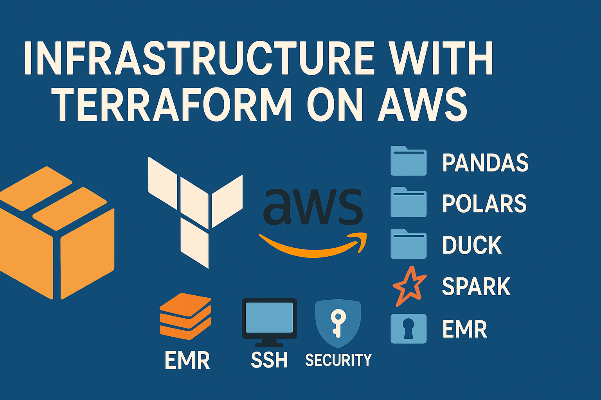

# 📦 Workshop 3 – AWS Infrastructure with Terraform

Welcome to Workshop 3! This project leverages Terraform to provision a variety of cloud resources on AWS. Each subdirectory is a self-contained module that builds a specific infrastructure component tailored for data processing with different Python technologies.

## 📁 Folder Overview

- `PANDAS/`: Launches an EC2 instance configured with Python and the Pandas library.
- `POLARS/`: Deploys an EC2 instance optimized for Polars, a lightning-fast dataframe library.
- `DUCK/`: Spins up EC2 with DuckDB support for embedded analytics.
- `SPARK/`: Creates an EC2 node prepared to run Spark locally.
- `EMR/`: Provisions a full Amazon EMR cluster for distributed Spark workloads.
- `ec2/`: Shared templates and configurations for EC2-related modules.
- `scripts/`: Shell scripts for dependency installation and environment checks.

## 🚀 How to Use This Repository

Inside each module directory, you’ll find:

- A complete Terraform configuration tailored to the tool.
- A companion `README.md` with setup instructions.
- CLI commands to install Python libraries or system packages.
- A screenshot to verify successful setup and correct execution.

## 🔐 Pre-Setup Requirements

Before connecting to any AWS instance, ensure the following:

- Your IAM role includes permissions for AWS Systems Manager (SSM).
- You have the AWS CLI installed and configured using `aws configure`.
- Your AWS user or role has permission to start SSM sessions.

## 🛰️ Connecting to EC2 via SSM

Use this command to open a session with your instance (ensure SSM agent is active):

```bash
aws ssm start-session --target <instance-id>
```

To get your instance ID:

```bash
aws ec2 describe-instances \
  --query "Reservations[].Instances[].InstanceId" \
  --output text
```

> ✅ Make sure the instance is `running` and has access to SSM endpoints (via Internet Gateway or a VPC endpoint).

## 🧪 Verifying Your Setup

After logging in via SSM, confirm everything installed correctly by running:

```bash
python3 --version
pip list | grep pandas  # Substitute with polars or duckdb as needed
```

Or test with an inline command:

```bash
python3 -c "import pandas as pd; print(pd.__version__)"
```

## 🌩️ Accessing EMR Master Node

To reach the master node in your EMR cluster:

1. List active EMR clusters:

```bash
aws emr list-clusters --active
```

2. Extract the master node’s instance ID:

```bash
aws emr list-instances \
  --cluster-id <cluster-id> \
  --instance-group-types MASTER \
  --query 'Instances[*].InstanceId' \
  --output text
```

3. Start your session:

```bash
aws ssm start-session --target <instance-id>
```

## 🖼️ What’s Documented

Each Terraform module comes with:

- A screenshot validating the tool’s correct setup.
- Connection proof via SSM.
- In the case of EMR, Spark execution from the master node.

## 🔒 Best Practices & Security Notes

- No SSH keys or public IPs are used — all access is via SSM.
- Avoid exposing ports or sensitive information.
- If outbound connectivity is needed, use a NAT Gateway or VPC endpoint setup.

---

Happy Terraforming!
